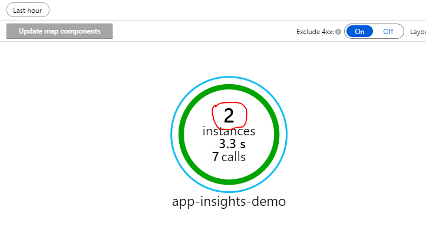
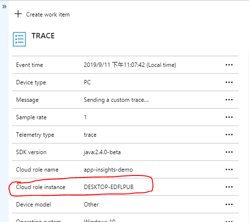
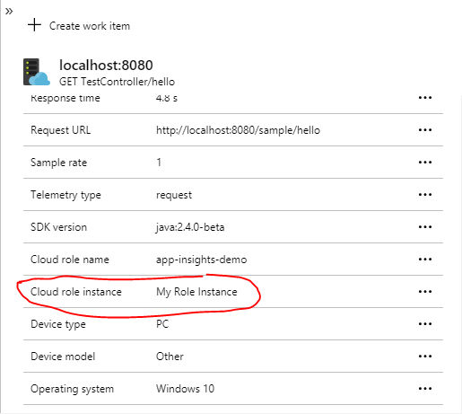

# 自定义设置 Application Map 的相同 Role 的不同 Instance 的名称（Cloud Role Instance）

> 本设置针对使用 SpringBoot 的应用程序。

如下图，对于同一个服务可能会有多个实例（默认的实例名为运行的机器名），以下步骤展示如何自定义该值：




1. 添加以下依赖
```xml
<dependency>
    <groupId>org.springframework.boot</groupId>
    <artifactId>spring-boot-autoconfigure</artifactId>
    <version>2.1.8.RELEASE</version>
</dependency>
<dependency>
    <groupId>org.springframework</groupId>
    <artifactId>spring-context</artifactId>
    <version>5.1.9.RELEASE</version>
</dependency>
```

2. 添加 telemetry 初始化类

> 参考链接：<br />
> https://github.com/microsoft/ApplicationInsights-Java/issues/632 <br />
> https://github.com/Microsoft/ApplicationInsights-Java/blob/master/azure-application-insights-spring-boot-starter/README.md

```java
package com.example.demo.configuration;

import com.microsoft.applicationinsights.telemetry.Telemetry;
import com.microsoft.applicationinsights.web.extensibility.initializers.WebTelemetryInitializerBase;

public class CloudRoleNameInitializer extends WebTelemetryInitializerBase {

    @Override
    protected void onInitializeTelemetry(Telemetry telemetry) {
        String computerName = System.getenv().get("COMPUTERNAME");
        telemetry.getContext().getCloud().setRoleInstance(computerName);
    }
}
```

3. 在初始类中使用该类
```java
package com.example.demo;

import com.example.demo.configuration.CloudRoleNameInitializer;
import com.microsoft.applicationinsights.extensibility.TelemetryInitializer;
import org.springframework.boot.SpringApplication;
import org.springframework.boot.autoconfigure.SpringBootApplication;
import org.springframework.context.annotation.Bean;

@SpringBootApplication
public class DemoApplication {

    public static void main(String[] args) {
        SpringApplication.run(DemoApplication.class, args);
    }

    @Bean
    public TelemetryInitializer myTelemetryInitializer() {
        return new CloudRoleNameInitializer();
    }
}
```

然后就可以得到自定义的 `cloud role instance` 了，Application Map 里的 Instance 数量就等于 `cloud role instance` 的不同值的所有数量。


