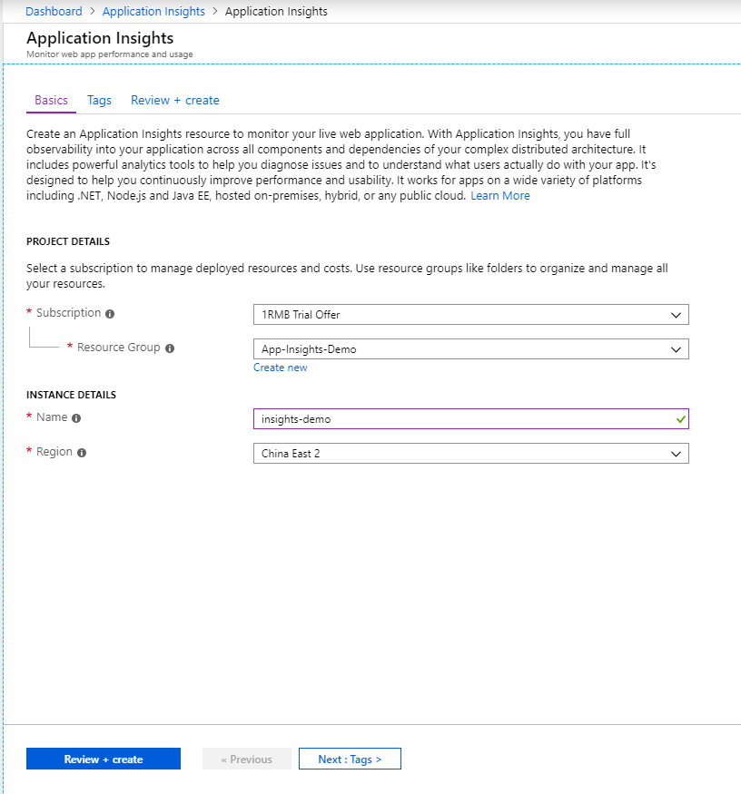

# Spring Boot 集成 Azure（中国） App Insights

> 参考文档：https://docs.microsoft.com/en-us/azure/azure-monitor/app/java-get-started

## 创建 Azure App Insights 资源

1. 浏览到位于 <https://portal.azure.cn/> 的 Azure（中国）门户，定位到 Application Insights，然后单击新建。


2. 在新建资源上，指定以下信息：

    - 选择订阅。
    - 选择资源组。
    - 输入资源名称。
    - 选择资源区域位置。

    

3. 资源创建后，导航到详情页面，可以查询到该 App Insights 的检测密钥。


## 将 Spring Boot 应用程序配置为使用 App Insights

1. 在项目的 POM.xml 文件中添加以下依赖项。

```xml
<dependency>
    <groupId>com.microsoft.azure</groupId>
    <artifactId>applicationinsights-spring-boot-starter</artifactId>
    <version>1.2.0-BETA</version>
</dependency>
```

2. 在项目的 application.properties 文件中添加以下属性（如果是yaml文件转化成层级结构）。

> 此处为中国版的 Azure 与国际版的有所不同，需要设置专有的 endpoint，获取更多关于 [endpoint](https://docs.microsoft.com/bs-latn-ba/azure/azure-monitor/app/custom-endpoints?view=aspnetcore-3.0#regions-that-require-endpoint-modification) 的相关配置。有关更详细的配置信息，请查看 <https://github.com/Microsoft/ApplicationInsights-Java/blob/master/azure-application-insights-spring-boot-starter/README.md>

```properties
# Specify the instrumentation key of your Application Insights resource.
azure.application-insights.instrumentation-key=[your ikey from the resource]
azure.application-insights.channel.in-process.endpoint-address=https://dc.applicationinsights.azure.cn/v2/track
# Specify the name of your springboot application. This can be any logical name you would like to give to your app.
spring.application.name=[your app name]
```

3. 在代码中引用 TelemetryClient 对象发送日志信息到 App Insights，以下为示例代码。

```java
package com.example.demo;

 import com.microsoft.applicationinsights.TelemetryClient;
 import java.io.IOException;
 import org.springframework.beans.factory.annotation.Autowired;
 import org.springframework.web.bind.annotation.GetMapping;
 import org.springframework.web.bind.annotation.RequestMapping;
 import org.springframework.web.bind.annotation.RestController;
 import com.microsoft.applicationinsights.telemetry.Duration;

 @RestController
 @RequestMapping("/sample")
 public class TestController {

     @Autowired
     TelemetryClient telemetryClient;

     @GetMapping("/hello")
     public String hello() {

         //track a custom event
         telemetryClient.trackEvent("Sending a custom event...");

         //trace a custom trace
         telemetryClient.trackTrace("Sending a custom trace....");

         //track a custom metric
         telemetryClient.trackMetric("custom metric", 1.0);

         //track a custom dependency
         telemetryClient.trackDependency("SQL", "Insert", new Duration(0, 0, 1, 1, 1), true);

         return "hello";
     }
 }
 ```

## 将 Springboot 应用程序配置为向 Application Insights 发送 log4j 日志

> 如果应用程序采用的是 Logback，请参照另外的配置，<https://docs.microsoft.com/zh-cn/azure/azure-monitor/app/java-trace-logs>

1. 修改项目的 POM.xml 文件，添加/修改如下 dependency 节。

```xml
<dependencies>
    <dependency>
        <groupId>org.springframework.boot</groupId>
        <artifactId>spring-boot-starter-web</artifactId>
        <exclusions>
            <exclusion>
                <groupId>org.springframework.boot</groupId>
                <artifactId>spring-boot-starter-logging</artifactId>
            </exclusion>
        </exclusions>
    </dependency>

    <dependency>
        <groupId>org.springframework.boot</groupId>
        <artifactId>spring-boot-starter-test</artifactId>
        <scope>test</scope>
    </dependency>

    <dependency>
        <groupId>org.springframework.boot</groupId>
        <artifactId>spring-boot-starter-log4j2</artifactId>
    </dependency>

    <dependency>
        <groupId>com.microsoft.azure</groupId>
        <artifactId>applicationinsights-spring-boot-starter</artifactId>
        <version>1.2.0-BETA</version>
    </dependency>

    <dependency>
        <groupId>com.microsoft.azure</groupId>
        <artifactId>applicationinsights-logging-log4j2</artifactId>
        <version>2.1.1</version>
    </dependency>
</dependencies>
```

2. 修改 log4j2.xml 的配置，添加新的 Appender。注意给 Appender 添加日志的记录级别，筛选掉应用程序不必要的日志，这里设置为 `level="info"`。

```xml
<?xml version="1.0" encoding="UTF-8" ?>
<Configuration packages="com.microsoft.applicationinsights.log4j.v2">
  <Properties>
    <Property name="LOG_PATTERN">
      %d{yyyy-MM-dd HH:mm:ss.SSS} %5p ${hostName} --- [%15.15t] %-40.40c{1.} : %m%n%ex
    </Property>
  </Properties>
  <Appenders>
    <Console name="Console" target="SYSTEM_OUT">
      <PatternLayout pattern="%d{HH:mm:ss.SSS} [%t] %-5level %logger{36} - %msg%n"/>
    </Console>
    <ApplicationInsightsAppender name="aiAppender">
    </ApplicationInsightsAppender>
  </Appenders>
  <Loggers>
    <Root level="trace">
      <AppenderRef ref="Console" level="info" />
      <AppenderRef ref="aiAppender" level="info" />
    </Root>
  </Loggers>
</Configuration>
```

运行应用程序，等待一段时间后，在 Azure 的管理页面的 App Insights 资源可以查看到对应的日志信息。

> *如果 java jdk 的版本过高，可能会遇到程序运行失败的情况（大概是因为 Java SE 9.0 中不再包含 Java EE 的指定包，参考 <https://blog.csdn.net/hadues/article/details/79188793>），此时在 POM.xml 中添加如下依赖项*

```xml
<dependency>
    <groupId>javax.xml.bind</groupId>
    <artifactId>jaxb-api</artifactId>
    <version>2.2.8</version>
</dependency>
```
